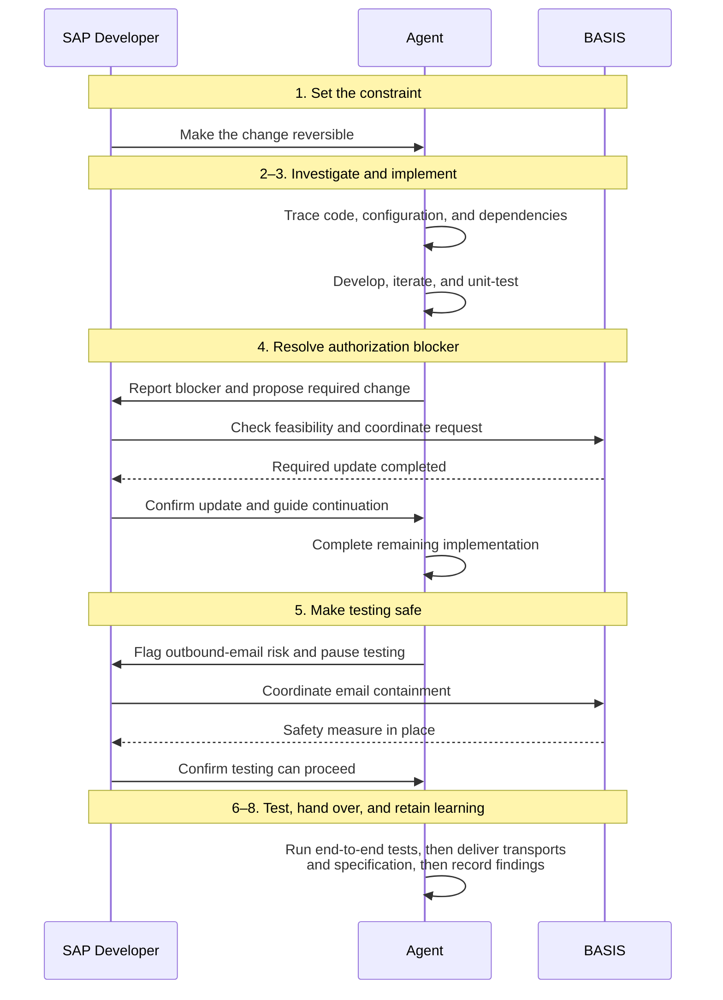

If an agent can investigate your custom code, write a solution, and run the tests, what exactly is the SAP developer supposed to do?

One of our clients had a useful example. They wanted to improve a purchase requisition approval email: include the PR details and add a link that opened the specific requisition in ME54N through SAP Web GUI.

Reasonable enough. Except the workflow was 14 years old, its original developer had left, and nobody on the current team knew it particularly well.

The client used Adri. I am affiliated with Adri, so this is the example I know firsthand. The part I want to discuss is how the agent, developer, and BASIS team divided the work.

## How was the work divided?

Follow the handoffs at the authorization blocker and the email risk. These are the points where the developer had to determine what could happen next.

The agent investigated approver identification, release strategy, and email delivery. It developed the email class and the workflow nodes and containers needed to call it. There were failed attempts and rework before it found an approach that fit the system.

After testing, it delivered the transports and technical specification and recorded the email-delivery pattern in the knowledge graph for future work. This account covers implementation and sandbox testing; it does not establish who approved or carried out the production deployment.

Three decisions in that sequence are worth looking at more closely.

## We need a way back if this goes wrong.

The developer made reversibility a success criterion before delegating the implementation.

The workflow already worked. The team did not know it deeply. If the change behaved unexpectedly, they needed a clear path back to the working version.

An agent can identify several technical concerns. Someone still has to rank them in the context of the business and the team's ability to recover. Here, the developer decided that being able to undo the change mattered enough to shape the solution.

That is a requirement you can easily miss if the task you hand over is simply “add PR details and a button to this email.”

For me, this is one responsibility that becomes more explicit when working with agents: describe the conditions that make a solution acceptable, as well as the functionality you want it to produce.

## Can we actually make that authorization change here?

During implementation, the agent found that it lacked the authorization to modify the workflow. It diagnosed the issue, prepared a detailed request for BASIS, and paused.

The developer took that request to the relevant stakeholders and checked whether it was viable in the client's environment. A proposed change can be technically sensible and still run into security policy or operational constraints.

This is where knowing the landscape and the people responsible for it matters. The developer had to understand the request well enough to discuss it, bring constraints back to the agent, and guide the next move.

BASIS completed the required update. The agent then resumed and finished the implementation.

The developer was doing more than forwarding a message. They were connecting a proposed technical solution with the organization that had to permit and support it.

## Where will the test emails actually go?

Before end-to-end testing, the agent identified that the sandbox could still deliver workflow emails to real users.

Calling it a sandbox does not help much when your test lands in an actual approver's inbox.

The agent stopped and requested a safety measure for outbound email. The developer coordinated with BASIS to establish what the environment could support. BASIS put the measure in place, and testing resumed after confirmation.

The agent spotted the risk in this case. The developer still had to coordinate the response and determine when it was safe to continue.

There are several separate responsibilities here: identify the risk, propose a response, change the environment, and confirm that the next action can proceed. The diagram makes those handoffs visible. “The agent tested the workflow” leaves quite a bit out.

## What does this mean for the developer or architect?

These responsibilities will sound familiar to experienced SAP developers and architects. The shift is in how much execution they can delegate, and how deliberately they need to define the conditions around that work.

In this case, the agent took on investigation, implementation, and test execution. The developer set a priority the solution had to respect, checked proposed changes against organizational constraints, and coordinated the decisions that let work resume. BASIS remained responsible for the environment changes described here.

My takeaway for an agent-assisted SDLC is to agree on three things before work starts:

- **What can the agent do within the agreed scope?** Define the task, constraints, and conditions that require it to pause.
- **What evidence must come back?** Decide how the implementation, test results, and recovery approach will be reviewed.
- **Who can authorize the next step?** Name the people responsible for environment changes, acceptance, and release.

Those are recommendations drawn from the story. The account does not document every review and approval, and preparing a transport alone does not establish who owns its release.

The developer had fewer implementation steps to execute personally, but still needed enough technical understanding to question the approach and make consequential decisions. For an architect, the same questions extend across the systems and teams affected by a change.

That is the question I would bring to the next project: when we delegate the work, have we also made clear who owns the decisions around it?
