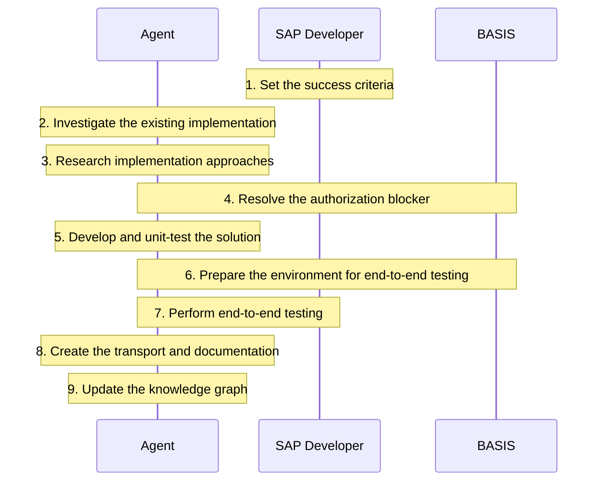

If an agent can investigate your custom code, implement a Change Request, and run the tests, what exactly is the SAP developer supposed to do? This is a question that I get frequently when we discuss our autonomous code development capabilities at Adri.

So, I thought I would illustrate how the role of an SAP developer is changing in an agent-led development workflow using the example of a Change Request from one of our clients. I am affiliated with Adri, so it is the example I know firsthand but you can extend this example to any agent with similar capabilities.

## What was the Change Request?

**SAP Landscape**: ECC
**Environment**: Dev sandbox

### Current Flow:

When a Purchase Requisiton is created, an email should be sent to a list of users for approval. This email contains:

- "a PR is ready for your approval. PR no is 123"

### Expected Flow:

Modify the workflow so that the email is now a rich HTML email that contains:

- the full PR details, including the PR number, requisitioner, created-by, supplier, purchasing group, plant, and total value.
- a working deep link that opens the SAP Web GUI directly on the PR release screen (ME54N) for that specific requisition so that the approver does not need to navigate to the SBWP inbox manually.

:::tip to-do
add an image showing the emails as per current flow vs. expected flow.
:::

:::info caveat
The workflow behind this approval flow was about 11 years old. It's original developer had left, and nobody on the current team knew it particularly well.
:::

## How did the work unfold?

### Step 1. Developer sets the success criteria

| Role      | Task                                                                                                                                                                                                                                                               |
| --------- | ------------------------------------------------------------------------------------------------------------------------------------------------------------------------------------------------------------------------------------------------------------------ |
| Agent     | No direct task at this step.                                                                                                                                                                                                                                       |
| Developer | Since the ABAP team did not know the existing workflow behind this approval flow deeply, the most important and non-negotiable criterion for the developer was that the change should be easy to reverse in case the modified implementation behaved unexpectedly. |
| Basis     | No direct task at this step.                                                                                                                                                                                                                                       |

### Step 2. Agent investigates the existing implementation

| Role      | Task                                                                                                                                                                   |
| --------- | ---------------------------------------------------------------------------------------------------------------------------------------------------------------------- |
| Agent     | Agent traced the custom code and configuration to understand how approvers were identified, which release strategy controlled approval, and how emails were delivered. |
| Developer | No direct task at this step.                                                                                                                                           |
| Basis     | No direct task at this step.                                                                                                                                           |

### Step 3. Agent researched possible implementation approaches

| Role      | Task                                                                                                                                 |
| --------- | ------------------------------------------------------------------------------------------------------------------------------------ |
| Agent     | Agent researched the system's configuration, and authorization setup and picked one approach that required minimal development work. |
| Developer | No direct task at this step.                                                                                                         |
| Basis     | No direct task at this step.                                                                                                         |

### Step 4. Agent, developer and basis resolved the authorization blocker.

| Role      | Task                                                                                                                                                                                  |
| --------- | ------------------------------------------------------------------------------------------------------------------------------------------------------------------------------------- |
| Agent     | Agent found that it could not modify the workflow with the available authorizations. It diagnosed the blocker, prepared a detailed request for BASIS and how they could implement it. |
| Developer | The developer discussed the request with BASIS, checked what the environment could support, and brought any constraints back to the agent.                                            |
| Basis     | Basis updated the authorization controls as per the specification created by Agent and in accordance with the firm's security policy.                                                 |

### Step 5. Agent developed and unit-tested the solution

| Role      | Task                                                                                                                                                  |
| --------- | ----------------------------------------------------------------------------------------------------------------------------------------------------- |
| Agent     | Agent changed workflow nodes, created workflow containers, and integrated with the existing email infrastructure. It also unit-tested the components. |
| Developer | No direct task at this step.                                                                                                                          |
| Basis     | No direct task at this step.                                                                                                                          |

### Step 6. Agent prepared the environment for end-to-end testing

| Role      | Task                                                                                                                                                                                                                               |
| --------- | ---------------------------------------------------------------------------------------------------------------------------------------------------------------------------------------------------------------------------------- |
| Agent     | Agent identified that the sandbox could send approval emails to real users. So, it requested a safety measure for outbound email so that only a chosen set of developers and architects receive the approval email during testing. |
| Developer | The developer discussed the request with BASIS, checked what the environment could support, and brought any constraints back to the agent.                                                                                         |
| Basis     | Basis updated the authorization controls as per the specification created by Agent and in accordance with the firm's security policy.                                                                                              |

### Step 7. Agent performed end-to-end testing

| Role      | Task                                                                                                                                                                                                                            |
| --------- | ------------------------------------------------------------------------------------------------------------------------------------------------------------------------------------------------------------------------------- |
| Agent     | Agent analyzed the release strategy for PRs and past PRs to create test PRs. This triggered test emails. The team members who were temporarily added for end to end testing confirmed that they received emails in their inbox. |
| Developer | Developer set the requirement that the agent must trigger the workflow by creating real PRs and monitoring the SAPConnect activities.                                                                                           |
| Basis     | No direct task at this step.                                                                                                                                                                                                    |

### Step 8. Agent created the transport and documentation

| Role      | Task                                                  |
| --------- | ----------------------------------------------------- |
| Agent     | Agent created the transport from development sandbox. |
| Developer | No direct task at this step.                          |
| Basis     | No direct task at this step.                          |

### Step 9. Agent updated the Knowledge Graph

| Role      | Task                                                                           |
| --------- | ------------------------------------------------------------------------------ |
| Agent     | Agent updated the knowledge graph with the firm's email-delivery code pattern. |
| Developer | No direct task at this step.                                                   |
| Basis     | No direct task at this step.                                                   |

## So what changes for the SAP developer?

A developer can delegate more investigation, implementation, and test execution to an agent. They still need to define what an acceptable solution looks like and decide when the work can proceed.

In practice, I would make four responsibilities explicit:

1. **Set priorities and constraints.**

Decide which risks matter most in the team’s circumstances. Here, limited knowledge of the existing workflow made reversibility non-negotiable.

The developer also specified how testing should happen: create real PRs and monitor SAPConnect.

2. **Check implementation feasibility.**

Assess proposed changes with BASIS and
security stakeholders, bring constraints back to the agent, and guide alternatives when needed.

3. **Define the evidence.**

Establish what must be verified before testing or accepting a change, including email containment, authorization controls, and recovery. A passing test is one input to that decision.

4. **Assign ownership.**

Make clear who can authorize continuation, approve a transport, and import it. Preparing the work does not settle who can release it.

As you can see, a developer still needs significant SAP and landscape knowledge to question the agent's approach and understand the consequences of its proposed changes.

I hope this gives you a clearer picture into how the roles and responsibilities of an SAP developer are changing as agents handle more and more of the development lifecycle. Happy to hear how your agentic development flow looks like.
